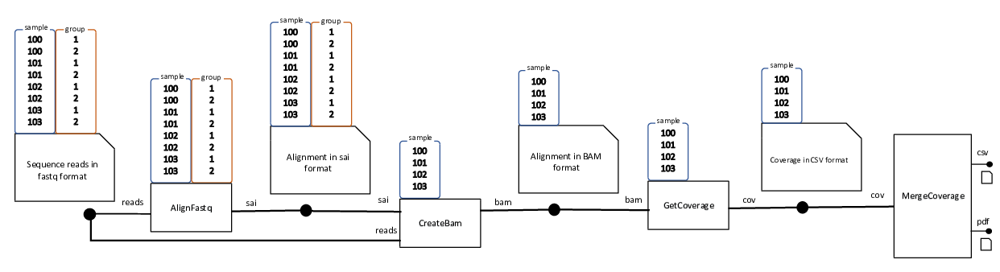
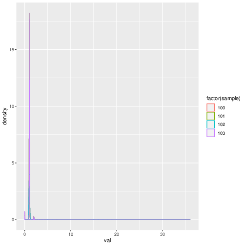

Example Pipeline
================

.. meta::
   :description lang=en: An example bioinformatics pipeline

Let us consider a bioinformatics pipeline with four stages as shown in the following figure:

In the first stage each of the 8 input FASTQ file of the form ``{sample}_{group}.fq``, where
sample can be any of 100,101,102,103 and group can be 1 or 2, is aligned to a reference genome 
and creates a temporary alignment file.

In the second stage, for each sample the two temporary alignment files for the two groups are
converted to a BAM alignment file.

In the third stage, a genome coverage table is generated for each sample.

In the final stage, the coverage tables for the four samples are consolidated into a single
coverage table. A a plot containing the coverage densities of the four samples as shown below
is also created.

